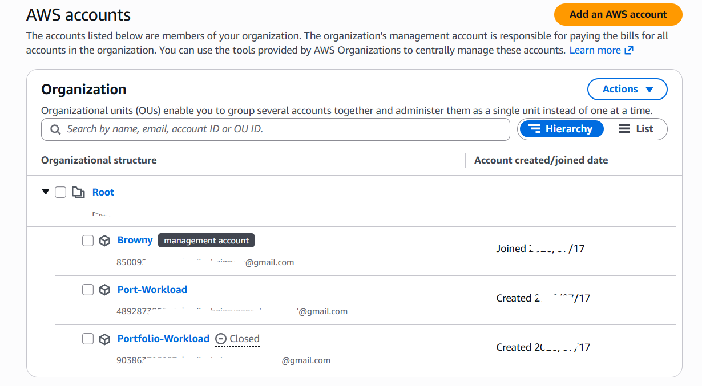
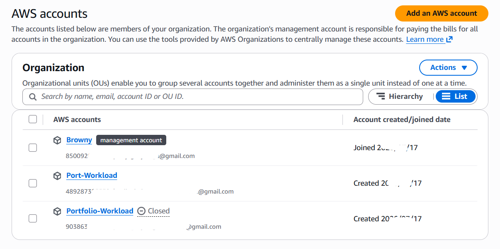
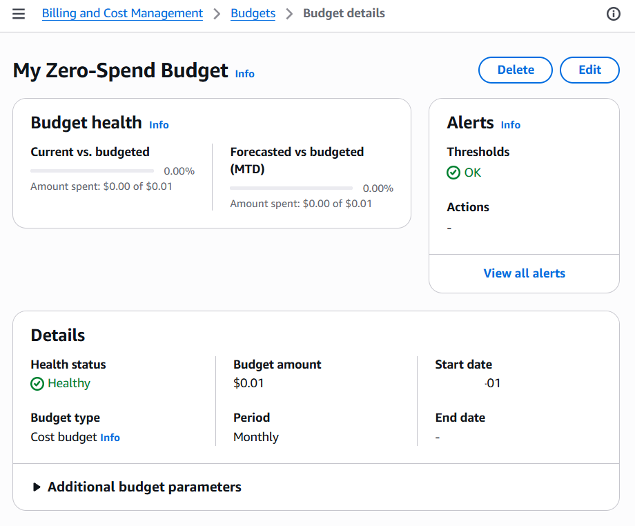
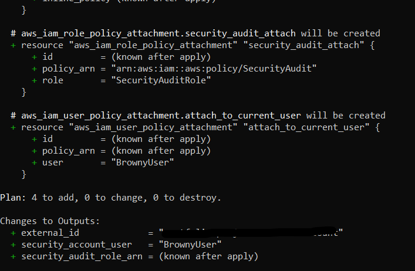
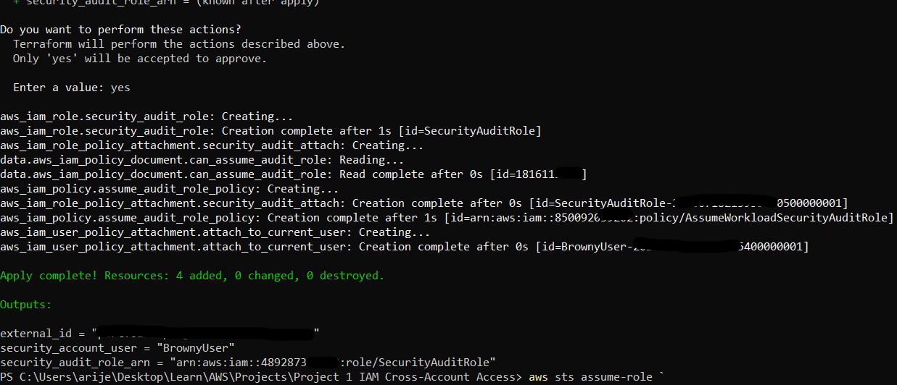
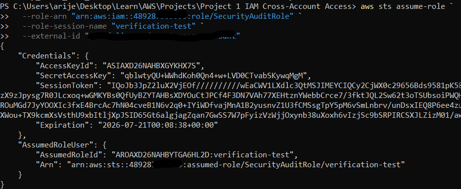
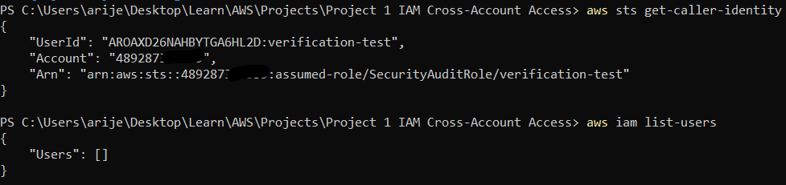
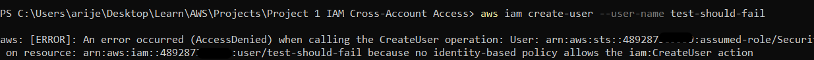
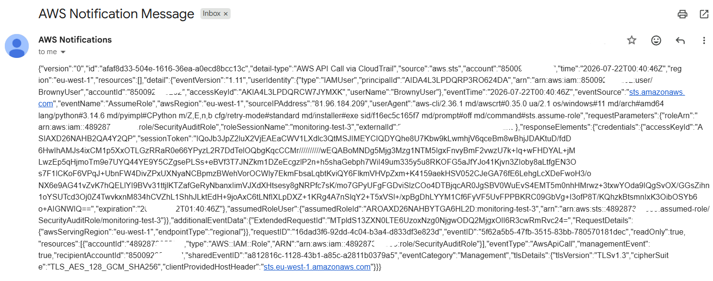

# Project 1: IAM Cross-Account Access

Building a production-style cross-account IAM pattern on AWS with Terraform; a scoped audit role in a Workload account, assumable only from a Security account, with real-time monitoring on top.

  

## Table of Contents
- [Why This Project](#why-this-project)
- [Architecture](#architecture)
- [The Problem, My Solution, and the Trade-offs I Made](#the-problem-my-solution-and-the-trade-offs-i-made)
- [Implementation Walkthrough](#implementation-walkthrough)
- [Verification](#verification)
- [Monitoring & Alerting](#monitoring--alerting)
- [Issues I Hit and How I Fixed Them](#issues-i-hit-and-how-i-fixed-them)
- [Reflection Questions](#reflection-questions)
- [Repository Structure](#repository-structure)
- [How to Reproduce This](#how-to-reproduce-this)
- [Further Reading](#further-reading)

## Why This Project

Almost every real AWS environment is multi-account, and almost every real security incident I've read about involving IAM comes down to permissions being either too broad, poorly monitored, or both. I built this project to actually implement (not just read about) the pattern most production AWS environments use to let a central security/audit function access other accounts safely: cross-account role assumption, least-privilege scoping, and monitoring on top of it.

## Architecture




```
┌────────────────────────────┐        AssumeRole         ┌────────────────────────────┐
│    SECURITY ACCOUNT        │ ─────────────────────────▶│    WORKLOAD ACCOUNT        │
│                            │   + External ID condition │                            │
│  IAM User: BrownyUser      │                            │  Role: SecurityAuditRole   │
│  Policy: sts:AssumeRole    │                            │  Policy: SecurityAudit     │
│  on SecurityAuditRole ARN  │◀─────────────────────────  │  (AWS managed, read-only)  │
│                            │   Temporary credentials    │                            │
└────────────────────────────┘   (1 hour, auto-expire)    └────────────────────────────┘
            │
            │  sts:AssumeRole calls logged here (caller's account)
            ▼
┌────────────────────────────┐
│  CloudTrail Trail           │
│  → EventBridge rule         │
│  → SNS Topic → Email alert  │
└────────────────────────────┘
```

I used one AWS Organization with two accounts; a **Security account** (the management account, where my IAM user lives) and a **Workload account** (the account being audited). I kept the whole thing at effectively $0 in AWS cost: IAM, Organizations, and STS are free regardless of usage, and the only resource with any real cost, a small CloudTrail S3 bucket, runs to a few cents a month at most for the volume of events this project generates.

## The Problem, My Solution, and the Trade-offs I Made

**The problem:** granting one account (or one person) access into another account is a common need, but it's also one of the easiest places to introduce a security hole; over-broad trust policies, standing credentials that never expire, or access nobody's watching.

**My solution:** I implemented AWS's recommended pattern for this; a role in the Workload account (`SecurityAuditRole`) with a trust policy that names exactly one principal (the Security account) and requires a matching External ID on every assumption attempt. I scoped the role's permissions to AWS's managed `SecurityAudit` policy rather than writing something broader, and I backed the whole thing with real-time monitoring so that every assumption of the role generates an email alert.

**Trade-offs I took:**
- I used a **single-region CloudTrail Trail** rather than a multi-region one, to keep both cost and setup complexity down. This means I'd only detect `AssumeRole` calls made against the `eu-west-1` STS endpoint; acceptable for a portfolio project scoped to one region, but I'd use a multi-region trail in a real production setup.
- I used **local Terraform state** rather than a remote backend (e.g., an S3 bucket + DynamoDB lock table). This is fine for a solo project with one operator, but I'm aware it wouldn't hold up for a team (concurrent applies would risk state corruption without a shared, locked backend).
- I chose the **AWS-managed `SecurityAudit` policy** over writing a fully custom policy. This was a deliberate speed-vs-precision trade-off: the managed policy is broader than the exact minimum I might define by hand, but it's a well-tested, purpose-built AWS policy, and reduces the risk of me mis-scoping a hand-rolled policy and leaving an unintended gap.

**Why I used the controls I used:**
- **External ID condition** - without it, this setup would be vulnerable to the ["confused deputy" problem](https://docs.aws.amazon.com/IAM/latest/UserGuide/confused-deputy.html): a third party could potentially trick a Workload-account resource into assuming a role using the Security account's identity. Requiring a shared secret value on every assumption closes that gap.
- **A managed, read-only policy instead of a custom write-capable one** - I didn't just assume this was read-only, I tested it (see [Verification](#verification)). Least privilege is a claim that means nothing until it's demonstrated by an actual denied write attempt.
- **Event-driven monitoring instead of just relying on the console's Event History** - I initially assumed I wouldn't need an active CloudTrail Trail, since the console shows a 90-day event history "for free." I was wrong (see [Issues I Hit](#issues-i-hit-and-how-i-fixed-them), #7); that console view doesn't feed EventBridge, so without a real Trail, I'd have had no way to actually *react* to an assumption event, only to look one up manually after the fact.

## Implementation Walkthrough

### Phase 1 — Account Structure

I created an AWS Organization from my existing account (making it the Security/management account), then added a Workload account underneath it.




I also set a zero-spend budget alert before touching anything else, as a safety net.




### Phase 2 — Terraform: The Cross-Account Role

I wrote the provider configuration to talk to both accounts from one Terraform run — my default credentials for the Security account, and an assumed `OrganizationAccountAccessRole` session for the Workload account:

```hcl
provider "aws" {
  alias  = "workload"
  region = var.region

  assume_role {
    role_arn = "arn:aws:iam::${var.workload_account_id}:role/OrganizationAccountAccessRole"
  }
}
```

I then defined the role's trust policy — this is the piece that decides *who* can assume the role, and under what conditions:

```hcl
data "aws_iam_policy_document" "trust_policy" {
  statement {
    effect  = "Allow"
    actions = ["sts:AssumeRole"]

    principals {
      type        = "AWS"
      identifiers = ["arn:aws:iam::${var.security_account_id}:root"]

      # NOTE: ":root" here does NOT mean the root user; in a trust policy's principal, it means "trust this AWS account," delegating the actual access decision to that
      # account's own IAM policies (see the AssumeWorkloadSecurityAuditRole policy attached to BrownyUser).
    }

    condition {
      test     = "StringEquals"
      variable = "sts:ExternalId"
      values   = [var.external_id]
    }
  }
}
```

...and attached AWS's managed `SecurityAudit` policy for the role's actual permissions:

```hcl
resource "aws_iam_role_policy_attachment" "security_audit_attach" {
  provider   = aws.workload
  role       = aws_iam_role.security_audit_role.name
  policy_arn = "arn:aws:iam::aws:policy/SecurityAudit"
}
```

I ran `terraform plan` to review the changes before applying anything:




Then applied it:




## Verification

Proving IAM policies work as intended matters more than just writing them, so I ran a three-part test using the actual role, not just a code review:

**1. Confirmed the identity switch:**
```bash
aws sts assume-role \
  --role-arn "arn:aws:iam::<WORKLOAD_ACCOUNT_ID>:role/SecurityAuditRole" \
  --role-session-name "verification-test" \
  --external-id "<EXTERNAL_ID>"

aws sts get-caller-identity
# "Arn": "arn:aws:sts::<WORKLOAD_ACCOUNT_ID>:assumed-role/SecurityAuditRole/verification-test"
```




**2. Confirmed the role can do what it should:**
```bash
aws iam list-users
# {"Users": []}
```




**3. Confirmed the role can't do what it shouldn't:**
```bash
aws iam create-user --user-name test-should-fail
# AccessDenied: ... is not authorized to perform: iam:CreateUser
```




That third step is the one I'd call out to anyone reviewing this project: a role "being read-only" is only a verified property once a write attempt is actually shown failing, not just assumed from the policy name.

## Monitoring & Alerting

I built a monitoring pipeline so that assuming this role doesn't happen silently: a CloudTrail Trail feeds management events to EventBridge, which matches on `sts:AssumeRole` calls against this specific role's ARN and publishes to an SNS topic with an email subscription.

```hcl
resource "aws_cloudwatch_event_rule" "assume_role_rule" {
  provider    = aws.security
  name        = "detect-security-audit-role-assumed"
  event_pattern = jsonencode({
    source      = ["aws.sts"]
    detail-type = ["AWS API Call via CloudTrail"]
    detail = {
      eventName         = ["AssumeRole"]
      requestParameters = { roleArn = [aws_iam_role.security_audit_role.arn] }
    }
  })
}
```

I re-ran the `assume-role` test after this was live, and received a real alert email:




## Issues I Hit and How I Fixed Them

I'm including this section in full because I think the debugging process demonstrates the underlying concepts better than a clean, mistake-free write-up would.

| # | Issue | Root Cause | Fix |
|---|-------|-----------|-----|
| 1 | `Could not connect to the endpoint URL: "https://sts.x.amazonaws.com/"` | My AWS CLI region was accidentally set to the literal string `x` | `aws configure set region <region>` |
| 2 | `AccessDenied` assuming `OrganizationAccountAccessRole` | My IAM user had no explicit `sts:AssumeRole` permission on that specific role ARN - `OrganizationAccountAccessRole` only trusts the management account's root by default, not individual users | Attached an inline policy granting `sts:AssumeRole` on that role's ARN |
| 3 | `AccessDenied` again, after account recreation | I'd closed and recreated my Workload account but hadn't updated the account ID everywhere it was referenced (tfvars, inline policy) | Updated the account ID consistently; reinforced why I use variables instead of hardcoded IDs |
| 4 | Confusing `AccessDenied` from Terraform itself | My shell still had temporary STS credentials exported as environment variables from manual testing, silently overriding my normal CLI profile | Cleared the env vars (`Remove-Item Env:\AWS_ACCESS_KEY_ID, ...`) |
| 5 | Monitoring never fired | I'd built the EventBridge rule in the Workload account, but `sts:AssumeRole` is logged by CloudTrail in the account of the **caller**, not the account owning the role | Moved all monitoring resources to the Security-account provider |
| 6 | `AccessDenied` reading old state after switching providers | Moving resources to a different provider isn't a "move" in Terraform; the state still pointed at resources in the old account | Used `terraform state rm` to untrack the stale entries, then reapplied cleanly |
| 7 | Still no alert email, even with the rule correctly targeted | EventBridge only receives CloudTrail events if an **active Trail** exists. The console's free 90-day Event History is a separate, view-only feature that doesn't feed EventBridge | Provisioned a real CloudTrail Trail (with a backing S3 bucket) via Terraform |

## Reflection Questions

**1. Why did I choose role assumption instead of long-lived credentials?**
Role assumption gives me temporary credentials (1 hour by default) instead of a permanent access key. My IAM user in the Security account never holds Workload-account credentials directly; only permission to *request* temporary ones, gated by the External ID condition. If my user's own credentials leaked, the blast radius stays inside the Security account.

**2. How would this scale to 20–100 accounts?**
Hand-writing one Terraform config per account, like I did here, doesn't scale. I'd move to AWS Organizations + SCPs + StackSets, or a Terraform `for_each` over a list of account IDs, to deploy the same role definition consistently across every account in an OU.

**3. What risks exist if a role is over-privileged?**
I tested this rather than assuming it: the `SecurityAudit` policy let a read succeed but denied a write attempt outright. If I'd used a broader policy like `AdministratorAccess`, a compromise of temporary credentials could have escalated to a full account takeover instead of staying contained to read-only exposure.

**4. How would I detect misuse?**
I actually implemented this; an EventBridge rule + SNS alert, backed by a real CloudTrail Trail, which was the hardest part of this project to get right (see issues #5 and #7). A fuller production setup would extend this to failed AssumeRole attempts, assumptions from unexpected IPs, and trust-policy modification events.

**5. What happens if the Security Account is compromised?**
This is the single point of failure in a hub-and-spoke trust model: since every Workload role trusts the Security account's principal, compromising the Security account gives an attacker a path into every account that trusts it. That's why I'd argue the Security account deserves the *most* hardening in a real org; enforced MFA, minimal standing IAM users, and its own dedicated monitoring. Nothing less.

## Repository Structure

```
.
├── README.md                     # this file
├── main.tf                       # the cross-account role and its policies
├── providers.tf                  # provider config for both accounts
├── variables.tf                  # input variables
├── outputs.tf                    # role ARN, alert topic ARN, etc.
├── monitoring.tf                 # CloudTrail, EventBridge, SNS alerting
├── terraform.tfvars.example      # copy to terraform.tfvars and fill in your own values
├── .gitignore
└── screenshots/                  # evidence referenced throughout this README
```

## How to Reproduce This

1. Install [Terraform](https://developer.hashicorp.com/terraform/downloads) and the [AWS CLI](https://docs.aws.amazon.com/cli/latest/userguide/getting-started-install.html)
2. Create an AWS Organization with a Security (management) account and at least one Workload account
3. Configure the AWS CLI with an IAM user in your Security account (`aws configure`)
4. Clone this repo, then:
   ```bash
   cp terraform.tfvars.example terraform.tfvars
   # edit terraform.tfvars with your own account IDs, region, and alert email
   terraform init
   terraform plan
   terraform apply
   ```
5. Verify with the commands in the [Verification](#verification) section above.

**Note on account IDs:** I redacted my real AWS account IDs from this README and from the committed Terraform files (they're supplied via `terraform.tfvars`, which is gitignored). Account IDs aren't strictly secret, but I treated them the way I'd treat any environment-specific config in a real project; kept out of version control by default.

## Further Reading

- [AWS: Tutorial — Delegate Access Across AWS Accounts Using IAM Roles](https://docs.aws.amazon.com/IAM/latest/UserGuide/tutorial_cross-account-with-roles.html)
- [AWS: The Confused Deputy Problem](https://docs.aws.amazon.com/IAM/latest/UserGuide/confused-deputy.html)
- [AWS Organizations Best Practices](https://docs.aws.amazon.com/organizations/latest/userguide/orgs_best-practices.html)
